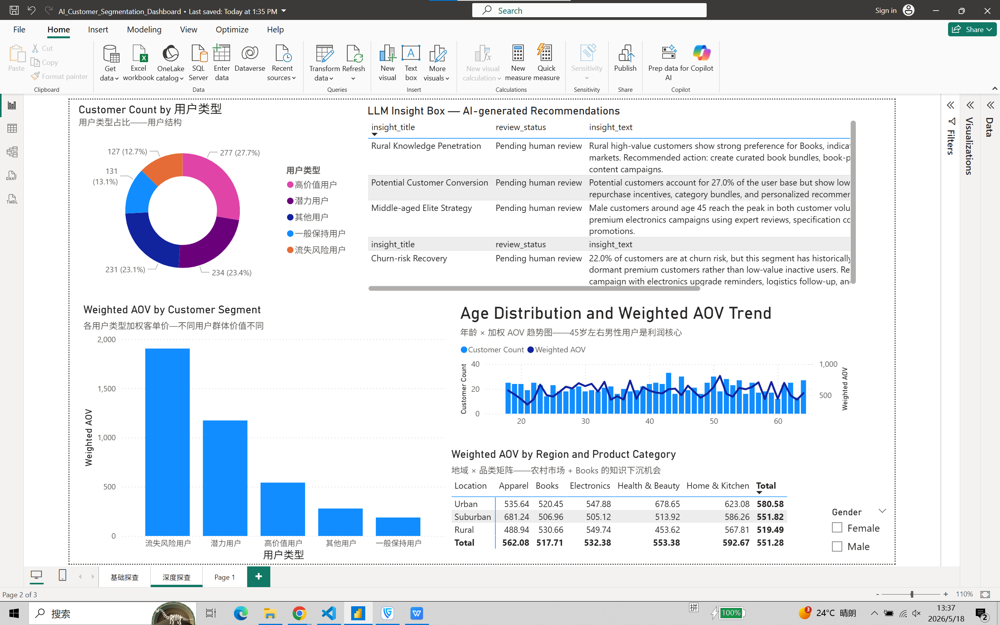

# AI-assisted Customer Segmentation Dashboard

## Project Overview

This project upgrades a traditional SQL + Power BI customer segmentation dashboard into an AI-assisted decision intelligence system for e-commerce customer operations.

The original dashboard focused on RFM-based customer segmentation and multi-dimensional business analysis. The upgraded version adds a Python-based LLM insight layer that converts structured customer segment data into executive summaries, marketing recommendations, and human-reviewable business actions.

The goal is not to replace business analysts. Instead, this project demonstrates how AI can help business teams move from **dashboard viewing** to **decision execution**.

---

## Business Context

Many e-commerce teams already have BI dashboards, but dashboards often stop at visualization. Business users still need to manually interpret charts, write reports, identify risks, and design campaign actions.

This project addresses that gap by building a workflow where:

1. SQL and structured CSV files define the customer segmentation logic.
2. Power BI visualizes customer value, AOV, segment distribution, and cross-dimensional insights.
3. Python reads structured business data.
4. A mock LLM client generates AI-assisted business insights.
5. AI recommendations are exported back into Power BI as an LLM Insight Box.
6. Every AI-generated recommendation is marked as pending human review.

---

## Key Business Findings

### 1. High-value Customers

High-value customers account for **27.7%** of the user base. They are the platform's core profit engine and should be protected through VIP retention, premium product recommendations, and loyalty programs.

### 2. Potential Customers

Potential customers account for **27.0%** of the user base. They have growth potential but relatively low repurchase frequency, which makes them suitable for conversion campaigns, category bundles, and repurchase incentives.

### 3. Churn-risk Customers

Churn-risk customers account for **22.0%** of the user base. More importantly, this group has historically high AOV above **¥3000**, meaning they should be treated as dormant premium customers rather than low-value inactive users.

### 4. Middle-aged Elite Segment

Male customers around age **45** reach the peak in both customer volume and weighted AOV, making them a core profit-driving segment. This group is suitable for premium electronics campaigns, expert reviews, specification comparisons, and VIP services.

### 5. Rural Knowledge Penetration Opportunity

Rural high-value customers show strong preference for the Books category, indicating a **knowledge penetration** opportunity in lower-tier markets. This suggests that rural markets should not be treated only as low-price markets.

---

## Tech Stack

| Layer | Tools / Methods |
|---|---|
| Data Layer | CSV, SQL logic, RFM segmentation |
| BI Layer | Power BI, DAX, data modeling |
| AI Layer | Python, mock LLM client, prompt-based insight generation |
| Output Layer | Markdown report, CSV insight output, Power BI LLM Insight Box |
| Risk Control | Human-in-the-loop review status |

---

## Repository Structure

```text
AI-assisted-Customer-Segmentation-Dashboard/
│
├── data/
│   ├── processed/
│   │   ├── customer_segments.csv
│   │   └── cross_dimensional_insights.csv
│   └── dictionary/
│       └── data_dictionary.md
│
├── sql/
│   ├── 01_data_cleaning.sql
│   ├── 02_rfm_metric_calculation.sql
│   ├── 03_customer_segmentation_rules.sql
│   └── 04_multidimensional_slice_analysis.sql
│
├── powerbi/
│   ├── AI_Customer_Segmentation_Dashboard.pbix
│   ├── dax_measures/
│   │   └── aov_measure.dax
│   └── screenshots/
│       └── 02_llm_insight_box.png
│
├── llm_agent/
│   ├── src/
│   │   ├── insight_generator.py
│   │   ├── llm_client.py
│   │   └── load_segment_data.py
│   └── outputs/
│       ├── segment_insights.md
│       └── powerbi_llm_insights.csv
│
├── docs/
├── portfolio/
├── requirements.txt
├── .gitignore
└── README.md
```

---

## AI Workflow

The AI workflow follows a structured decision pipeline:

```text
Structured customer segment data
        ↓
Python data loading
        ↓
Prompt construction
        ↓
Mock LLM insight generation
        ↓
Markdown and CSV output
        ↓
Power BI LLM Insight Box
        ↓
Human-in-the-loop review
```

The current version uses a mock LLM client for local development and demo stability. This avoids exposing API keys while keeping the architecture modular.

In production, the same `call_llm()` interface can be connected to OpenAI, Gemini, Claude, or an enterprise-hosted LLM API.

---

## DAX Measure Design

Because the current dataset is aggregated at the user level and does not contain raw order IDs, AOV is calculated as **weighted AOV**:

```DAX
Total Spending =
SUM(Fact_User_Behavior[Total_Spending])

Total Purchase Frequency =
SUM(Fact_User_Behavior[Purchase_Frequency])

Weighted AOV =
DIVIDE(
    [Total Spending],
    [Total Purchase Frequency]
)
```

This is more reliable than simply averaging the existing `Average_Order_Value` column.

If raw order-level transaction data becomes available in the future, the AOV measure can be upgraded to:

```DAX
Total Sales = SUM(Sales[Amount])

Order Count = DISTINCTCOUNT(Sales[OrderID])

AOV = DIVIDE([Total Sales], [Order Count])
```

This reflects a key data modeling principle: **metrics must be designed according to the granularity of the dataset**.

---

## LLM Insight Output

The Python LLM layer generates business-ready outputs such as:

- Executive summary
- Segment interpretation
- Priority marketing actions
- Human-in-the-loop review checklist

Example AI-generated recommendation:

> Churn-risk customers account for 22.0% of users and have historically high AOV above ¥3000. They should be treated as dormant premium customers rather than low-value inactive users. Recommended action: launch a high-priority win-back campaign with electronics upgrade reminders, logistics follow-up, and after-sales recovery.

---

## Power BI Integration

AI-generated recommendations are exported as:

```text
llm_agent/outputs/powerbi_llm_insights.csv
```

This CSV is loaded back into Power BI and displayed as an **LLM Insight Box**.

Each recommendation includes:

- `insight_title`
- `insight_text`
- `review_status`

The `review_status` field is designed to support human-in-the-loop governance. In the current prototype, recommendations are marked as:

```text
Pending human review
```

---

## Screenshot



---

## How to Run Locally

### 1. Create a virtual environment

```powershell
python -m venv .venv
.venv\Scripts\Activate.ps1
```

### 2. Install dependencies

```powershell
python -m pip install -r requirements.txt
```

### 3. Generate AI insights

```powershell
python llm_agent\src\insight_generator.py
```

The generated report will be saved to:

```text
llm_agent/outputs/segment_insights.md
```

The Power BI-ready insight file is located at:

```text
llm_agent/outputs/powerbi_llm_insights.csv
```

---

## Risk Control and Human Review

This project does not allow AI to directly execute customer-facing campaigns.

The LLM layer only generates draft recommendations. Before any business action is taken, human reviewers must verify:

- Whether the segment definition is correct
- Whether the data source is reliable
- Whether the marketing message is accurate
- Whether the recommendation matches business reality
- Whether logistics, after-sales, and inventory capacity can support the campaign

This design reflects a practical enterprise AI principle:

> AI accelerates decision preparation, but humans remain responsible for final business decisions.

---

## Business Value

This project demonstrates how AI can improve business decision-making in four ways:

1. Transform static BI dashboards into actionable decision workflows.
2. Reduce manual reporting workload for business analysts.
3. Convert customer segmentation results into marketing recommendations.
4. Add human-in-the-loop governance to reduce AI hallucination and business execution risk.

---

## Role Relevance

This project is designed for AI Solutions Intern, AI Pre-sales Intern, Technical Consultant Intern, and Business Intelligence-related roles.

It demonstrates the ability to:

- Understand business pain points
- Build structured data workflows
- Design reliable BI metrics
- Integrate AI into business decision processes
- Communicate insights in a solution-oriented way
- Balance AI automation with human review and risk control