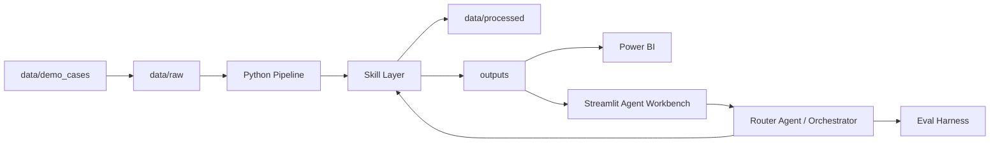

# AI-assisted Customer Segmentation Dashboard

**基于 RFM、Power BI、LLM 洞察与 Agent Workbench 的 AI 辅助商业智能分析系统**

这是一个 **AI-assisted BI Workflow** 作品集项目。它不是静态 Power BI 看板，也不是普通 AI 聊天机器人，而是把数据处理、客户分群、经营洞察、Power BI 刷新、自然语言问答和 Agent 编排串成一个可重复运行的分析闭环。

## 项目解决的问题

传统 BI 往往只展示图表结果，业务人员还需要自己解释指标、追问原因、整理洞察和设计运营动作。普通 LLM 虽然能生成文字，但容易编造数字、缺少指标口径，也难以评估回答是否可靠。

本项目通过 **Python Pipeline + Skill Layer + LLM Insight + Power BI + Streamlit Agent Workbench + Eval Harness** 形成闭环：

- Python 负责确定性计算，输出 RFM 分群、用户级 scored fact table 和 structured summary。
- LLM 只负责把结构化 summary 转成中文经营洞察，不直接计算业务数字。
- Router Agent / Orchestrator 负责识别业务问题并编排已有 Skill。
- Power BI 和 Streamlit 读取同一套 pipeline 输出，保证图表和 AI 洞察一致。
- Eval Harness 用测试集验证 Router / Agent 行为的稳定性。

## 核心业务价值

- raw 数据源变化后，可一键重跑 pipeline。
- 自动生成 RFM 客户分群、用户级评分明细表和中文 AI 经营洞察。
- Power BI 刷新后，主图表和 AI Insight Box 同步更新。
- 业务人员可在 Streamlit 页面输入自然语言问题，例如“这个数据的用户 RFM 是多少？”。
- Eval Harness 验证 Router / Orchestrator 的意图识别、工具选择、风险边界和回答关键内容。
- Mock / SiliconFlow 双模式支持稳定演示和真实 API 展示。
- Numeric validation / fallback 机制降低 LLM 编造业务数字的风险。

## 系统架构



架构说明：

- **Python Skill** 负责确定性计算，包括数据清洗、RFM、Weighted AOV、分群和导出。
- **LLM** 只解释结构化 summary，不直接算数。
- **Router Agent** 负责任务识别和安全边界判断。
- **Orchestrator** 只调用白名单 Skill 和本地脚本，不执行任意 shell。
- **Eval Harness** 用测试集验证 Agent 行为可靠性。

## 功能亮点

- 场景化 raw 数据源切换：`baseline_original` / `apparel_vip_shift`
- RFM 客户分群与用户级 scored fact table
- Weighted AOV 指标口径，避免简单平均造成误导
- 中文 AI 经营洞察与 Markdown 报告
- Power BI 联动刷新：主图表读取 scored fact，AI Insight Box 读取 insight CSV
- Streamlit 业务展示页：KPI cards、分群图表、洞察卡片、自然语言问答
- Router Agent / Orchestrator：确定性路由与轻量编排
- Eval Harness：当前测试集可达到 100% pass rate
- Mock / SiliconFlow 双模式
- Numeric validation / fallback 防止关键业务数字失控

## 快速演示命令

稳定展示版建议使用 `mock`，不依赖网络和真实 API：

```cmd
.venv\Scripts\python.exe scripts\apply_raw_case.py baseline_original
.venv\Scripts\python.exe run_pipeline.py --provider mock
.venv\Scripts\python.exe scripts\apply_raw_case.py apparel_vip_shift
.venv\Scripts\python.exe run_pipeline.py --provider mock
.venv\Scripts\python.exe -m streamlit run streamlit_agent_app.py
.venv\Scripts\python.exe eval\run_eval.py
```

真实 API 展示版：

```cmd
.venv\Scripts\python.exe run_pipeline.py --provider siliconflow
```

`.env` 中配置 `SILICONFLOW_API_KEY` 后才会真实调用 API。项目默认不自动调用真实 API。

## 主要输出文件

```text
data/processed/fact_user_behavior_scored.csv
data/processed/customer_segments.csv
outputs/powerbi_llm_insights.csv
outputs/segment_insights.md
outputs/run_metadata.json
eval/eval_results.csv
```

## 版本路线

- **V3.1 Pipeline**：raw 数据处理、RFM 分群、LLM 洞察、Power BI 输出
- **V3.2 Skill Layer**：将确定性能力拆成可复用 Skill
- **V3.3 Router Agent**：新增轻量 Router / Orchestrator / Trace
- **V3.4 Eval Harness**：用测试集验证 Agent 行为
- **V3.5 Streamlit Workbench**：新增业务人员前端
- **V3.5.1 中文业务展示 UI**：中文化展示与咨询风格页面
- **V4.0 中文作品集交付包装**：面向国内 HR、中文飞书作品集和中文面试讲解

## 适合岗位

- AI 解决方案实习
- AI 售前实习
- 技术顾问实习
- BI / 数据分析实习
- LLM 应用实习

## 项目展示

项目截图和完整 Case Study 已整理在飞书作品集页面中。GitHub 仓库主要用于展示代码结构、运行方式、技术文档和项目实现。

## 项目边界

这是作品集 Demo / 原型系统，不夸大为生产上线系统。真实企业落地还需要补充权限控制、数据权限、任务调度、服务化 API、监控告警、审计日志、评估体系扩展和更严格的数据治理。
