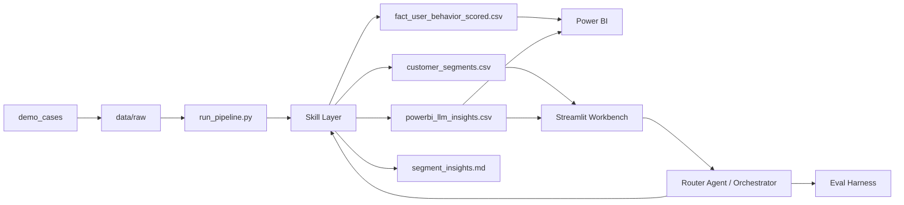

# AI 辅助型客户分群与 BI 决策系统

## 项目背景

很多企业已经有 Power BI、Tableau 或 Excel Dashboard，但实际业务使用中仍然存在三个问题：看板只展示结果、不主动解释；业务人员需要手动整理洞察和行动建议；如果直接把 CSV 丢给 LLM，又容易出现指标口径不清、数字幻觉和不可评估的问题。

本项目尝试把传统 BI Dashboard 升级为 **AI-assisted BI Workflow**：Python 负责数据处理和确定性计算，LLM 负责把结构化结果转成中文经营洞察，Agent 负责自然语言入口和任务编排，Eval Harness 负责验证行为可靠性。

## 我的目标岗位定位

这个项目主要服务于国内以下岗位的作品集展示：

- AI 解决方案实习
- AI 售前实习
- 技术顾问实习
- BI / 数据分析实习
- LLM 应用实习

它重点展示我对“业务问题 - 数据分析 - AI 应用 - 可演示系统 - 风险控制”的完整理解，而不是只展示一个单点模型或静态图表。

## 业务问题

电商用户运营团队希望回答：

- 不同客户群体的价值差异是什么？
- 哪些客户应该重点留存、转化、召回或培育？
- raw 数据源变化后，分群结果和 BI 图表能否快速同步？
- 业务人员能否用自然语言追问当前数据？
- AI 生成的经营建议是否有结构化数据依据？

## 技术方案

项目采用轻量工程架构，不引入 LangChain / LangGraph / FastAPI / Docker / 数据库等大型依赖：

- **Pipeline**：读取 `data/raw/`，清洗数据，生成 processed CSV 和 outputs。
- **RFM Segmentation**：计算 recency、frequency、monetary、Weighted AOV、Value Proxy Score 和分群标签。
- **Skill Layer**：把数据质量、分群、洞察生成、Power BI 导出检查拆成确定性 Skill。
- **LLM Insight**：支持 Mock / SiliconFlow 双模式，生成中文经营洞察。
- **Numeric Validation**：校验 LLM 输出中的关键业务数字是否来自 structured summary。
- **Router Agent / Orchestrator**：根据业务问题选择对应工具或 Skill，默认 dry-run。
- **Eval Harness**：用测试集验证 intent、tools、risk、refusal 和回答关键内容。
- **Streamlit Workbench**：提供业务展示型页面，包括 KPI、图表、洞察卡片和自然语言问答。
- **Power BI Integration**：Power BI 主图表读取 scored fact table，AI Insight Box 读取 insight CSV。

## 系统架构



## 模块拆解

### Pipeline

`run_pipeline.py` 是主入口，执行数据质量检查、RFM 分群、LLM 洞察生成和 Power BI 输出检查。

### Skill Layer

`skills/` 下封装可复用的确定性能力。这样未来如果接入更复杂 Agent，也可以让 Agent 调用 Skill，而不是直接操作底层代码。

### Router Agent / Orchestrator

`agents/` 下实现轻量路由和编排。Router 不调用 LLM，而是用确定性规则识别问题类型，例如列出 demo case、对比分群变化、查看 workflow 状态、解释 Power BI 流程、回答 RFM 摘要问题。

### LLM Insight

LLM 只接收 Python 生成的 structured summary，不直接读取用户级明细，也不直接计算业务指标。Mock 模式用于稳定演示，SiliconFlow 模式用于真实 API 展示。

### Eval Harness

`eval/` 下维护测试集和评估脚本。它验证 Router / Orchestrator 是否稳定，而不是只靠一次 demo 跑通。

### Streamlit Workbench

`streamlit_agent_app.py` 是业务展示页，包含经营总览、业务问答、洞察输出和折叠开发者模式。

## 演示流程

稳定演示建议使用 `mock`：

```cmd
.venv\Scripts\python.exe scripts\apply_raw_case.py baseline_original
.venv\Scripts\python.exe run_pipeline.py --provider mock
.venv\Scripts\python.exe scripts\apply_raw_case.py apparel_vip_shift
.venv\Scripts\python.exe run_pipeline.py --provider mock
.venv\Scripts\python.exe -m streamlit run streamlit_agent_app.py
.venv\Scripts\python.exe eval\run_eval.py
```

真实 API 展示：

```cmd
.venv\Scripts\python.exe run_pipeline.py --provider siliconflow
```

## Mock / API 双模式

- `mock`：不依赖网络，适合稳定展示和面试现场演示。
- `siliconflow`：真实调用 SiliconFlow API，展示 LLM 接入能力。

如果 API 调用失败或 numeric validation 不通过，系统会 fallback 到 mock，并在 `outputs/run_metadata.json` 中记录 provider、api_reached、validation_passed、fallback_used、error_type 等字段。

## Eval Harness 解释

Eval Harness 不测试真实 LLM API，因为 API 受网络、模型状态和 key 配置影响。它重点测试本地确定性 Agent 行为：

- intent 是否识别正确
- selected tools 是否符合预期
- risk_level 是否正确
- dry_run 是否默认安全
- 高风险请求是否拒绝
- final answer 是否包含关键业务信息

当前测试集可达到 100% pass rate。

## 面试亮点

- 能把 BI 项目从“展示图表”推进到“辅助决策工作流”。
- 能说明为什么 LLM 不应该直接算数，而应该解释 structured summary。
- 能解释 Skill Layer、Router Agent、Eval Harness 的职责边界。
- 能展示 Power BI、Python、LLM API、Streamlit、Eval 的完整闭环。
- 能说明 numeric validation / fallback 如何降低 AI 幻觉和 API 不稳定风险。

## 后续企业级扩展方向

- 增加权限控制和数据权限隔离
- 将 pipeline 服务化为 FastAPI
- 引入任务调度和运行历史管理
- 扩展 SQL sandbox 和指标口径管理
- 建立更完整的 LLM evaluation harness
- 增加 trace viewer、告警和审计
- 对接企业 CRM / CDP / BI 数据仓库

## 项目边界

这是作品集项目 / Demo 系统 / 原型系统，不夸大为生产上线系统。当前重点是证明我能围绕业务场景设计一个可运行、可解释、可演示、可评估的 AI BI 工作流。真实企业上线还需要补充权限、安全、数据治理、稳定性、监控和部署体系。
