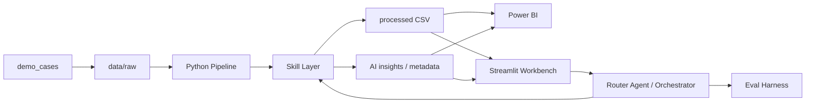

# AI 辅助型客户分群与 BI 决策系统

## 项目定位

这是一个面向电商客户运营场景的 **AI-assisted BI Workflow** 作品集项目。它把 raw 数据源切换、Python 数据处理、RFM 客户分群、中文 AI 经营洞察、Power BI 刷新、自然语言问答和 Agent 编排串成一个可演示的分析闭环。

项目重点不是做一个静态看板，而是展示如何把 BI 从“看图表”升级为“可追问、可解释、可复跑、可评估”的 AI 辅助决策流程。

## 为什么做这个项目

传统 BI 看板可以展示指标，但业务人员仍然要自己解释原因、整理洞察和设计行动方案。直接使用 LLM 分析 CSV 又容易出现编造数字、指标口径不清和结果不可评估的问题。

因此我设计了这个项目：让 Python 负责确定性计算，让 LLM 只解释结构化 summary，让 Agent 负责任务识别和编排，让 Eval Harness 验证 Agent 行为是否可靠。

## 解决了什么业务问题

- raw 数据源变化后，如何快速重新生成客户分群和经营洞察？
- 高价值客户、潜力客户、流失风险客户应该如何区分？
- Power BI 图表和 AI Insight Box 如何保持同一套分群口径？
- 业务人员能否用自然语言追问当前数据？
- 如何降低 LLM 编造业务数字的风险？

## 最终效果

- 一键运行 pipeline，重新生成 processed CSV、中文 AI 洞察和 metadata。
- Power BI 刷新后，主图表和 AI Insight Box 同步变化。
- Streamlit 页面展示 KPI cards、分群图表、洞察卡片和业务问答。
- Agent 能回答“这个数据的用户 RFM 是多少？”、“对比两个 demo case 的分群变化”等问题。
- Eval Harness 用测试集验证 Router / Orchestrator 的稳定性。

## 系统架构图

## 核心模块

- **Pipeline**：读取 raw 数据，清洗并生成 RFM 分群结果。
- **Skill Layer**：封装数据质量、RFM 分群、洞察生成和 Power BI 输出检查。
- **LLM Insight**：支持 Mock / SiliconFlow 双模式，生成中文经营洞察。
- **Numeric Validation**：校验 LLM 输出的关键业务数字是否来自 structured summary。
- **Router Agent / Orchestrator**：识别业务问题并编排已有能力。
- **Eval Harness**：验证 intent、tools、risk、dry-run 和回答内容。
- **Streamlit Workbench**：面向业务人员展示经营总览、业务问答和洞察输出。
- **Power BI**：展示分群图表和 AI Insight Box。

## 展示流程

1. 打开 Streamlit 经营总览，看当前 KPI 和客户分群图表。
2. 切换 demo case，运行 mock pipeline。
3. 刷新 Power BI，看主图表和 AI Insight Box 是否同步变化。
4. 在业务问答中输入“这个数据的用户 RFM 是多少？”。
5. 运行 Eval Harness，展示 Agent 行为不是偶然跑通，而是可测试。

## 我的贡献

- 设计 AI-assisted BI Workflow 的整体架构。
- 实现 raw 数据处理、RFM 分群、Weighted AOV 和用户级 scored fact table。
- 接入 Mock / SiliconFlow 双模式 LLM 洞察生成。
- 设计 numeric validation 和 fallback 机制，降低业务数字幻觉风险。
- 拆分 Skill Layer，为未来 Agent 调用提供确定性能力边界。
- 实现 Router Agent / Orchestrator / Trace。
- 构建 Eval Harness 测试 Router 和 Orchestrator 的可靠性。
- 构建 Streamlit 业务展示页和 Power BI 联动输出。
- 完成中文作品集包装、面试脚本和技术说明文档。

## 技术亮点

- LLM 不直接算数，业务数字来自 Python structured summary。
- Power BI 和 Streamlit 使用同一套 pipeline 输出，避免图表和洞察口径不一致。
- Agent 默认 dry-run，危险操作不自动执行。
- Eval Harness 覆盖常见业务问题、高风险请求和未知问题。
- Mock 模式保证面试现场稳定展示，API 模式展示真实 LLM 接入能力。

## 业务价值

项目展示了如何把客户分群分析从“数据结果展示”推进到“经营决策准备”：

- 缩短业务人员整理报告和洞察的时间。
- 让分群、洞察、图表和问答使用同一套数据口径。
- 降低 LLM 编造业务指标的风险。
- 让 AI BI 系统具备可演示、可复跑、可评估的工程化特征。

## 面试官可以如何体验

- 先看 Streamlit 首页，理解业务价值和图表输出。
- 再看 Power BI，确认图表和 AI Insight Box 读取同一套结果。
- 然后输入自然语言问题，观察 Agent 的业务回答。
- 最后运行 Eval Harness，确认 Agent 行为可测试。

## 项目链接占位

- GitHub：
- Power BI 截图：
- Streamlit 截图：
- Demo 视频：
